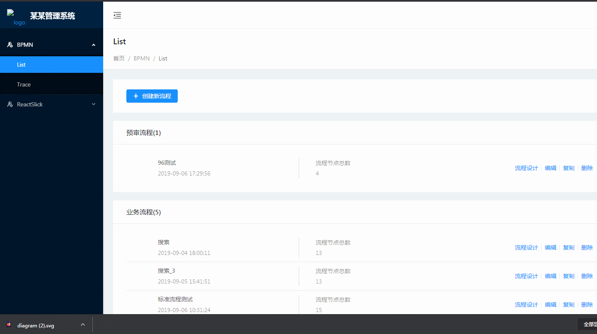
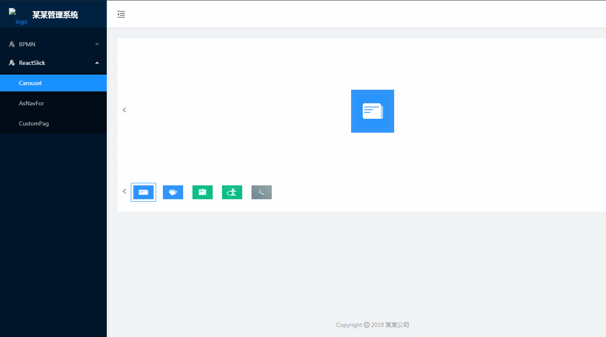

# 某某管理系统

## 目录结构
```
|-- config                                # umi配置，包含路由配置
|-- mock                                  # 本地模拟数据
|-- public                                
|   |-- favicon.png                       # Favicon
|   |-- icons                          # 字体图标资源
|-- src                                   # 开发目录
|   |-- assets                            # 本地静态资源
|   |-- components                        # 业务组件
|   |-- layout                            # 布局组件
|   |-- models                            # 全局dva model
|   |-- services                          # 接口服务
|   |-- pages                             # 页面模板
|   |-- tests                             # 单元测试
|   |-- e2e                               # 冒烟测试／ui测试
|   |-- defaultSettings.js                # 全局界面配置
|   |-- global.less                       # 全局css
|-- .gitignore                            # git忽略文件
|-- .editorconfig                         # 编辑器代码风格配置
|-- .eslintignore                         # eslint忽略文件
|-- .eslintrc                             # eslint规则
|-- .prettierignore                       # 代码风格配置忽略文件
|-- .prettierrc                           # 代码风格配置文件
|-- .stylelintrc                          # 样式风格配置文件
|-- package.json                          # 依赖及配置
|-- README.md                             # 简介
```

## 功能

### 1、pages/Bpmn

流程设计相关页面，用于设计业务的流程走向，通过 `xml` 传送给接口，主要实现流程设计、区域缩放、预览、撤销/回退、下载 `xml`、`svg` 等功能：


* 关于 `BPMN` 的总结详见 [BPMN使用小结](https://juejin.im/post/6844903940954259470)
* 本项目中引入的插件详见: [bpmn-js](https://github.com/bpmn-io/bpmn-js)、[bpmn-js-examples](https://github.com/bpmn-io/bpmn-js-examples)

### 2、pages/ReactSlick

走马灯相关页面，主要实现图片的切换、旋转、缩放等功能：


## 权限控制

`页面名称-按钮名称`

## 项目启动方法
yarn install

## 本地服务
yarn start // localhost:8000

## 联调环境
yarn run dev

## 测试环境
yarn run beta

## 正式环境
yarn run build

## 插件/框架

* [Umi](https://umijs.org/zh-CN/docs)
* [Dva](https://dvajs.com/guide/concepts.html#state)
* [Ant design pro](https://pro.ant.design/docs/getting-started-cn)

## 温馨提示

希望这个项目可以解决你目前的困惑/困扰，如果疑问或见解，欢迎给我提 [Isuess](https://github.com/wqjiao/bpmn-activiti/issues) 哦！
